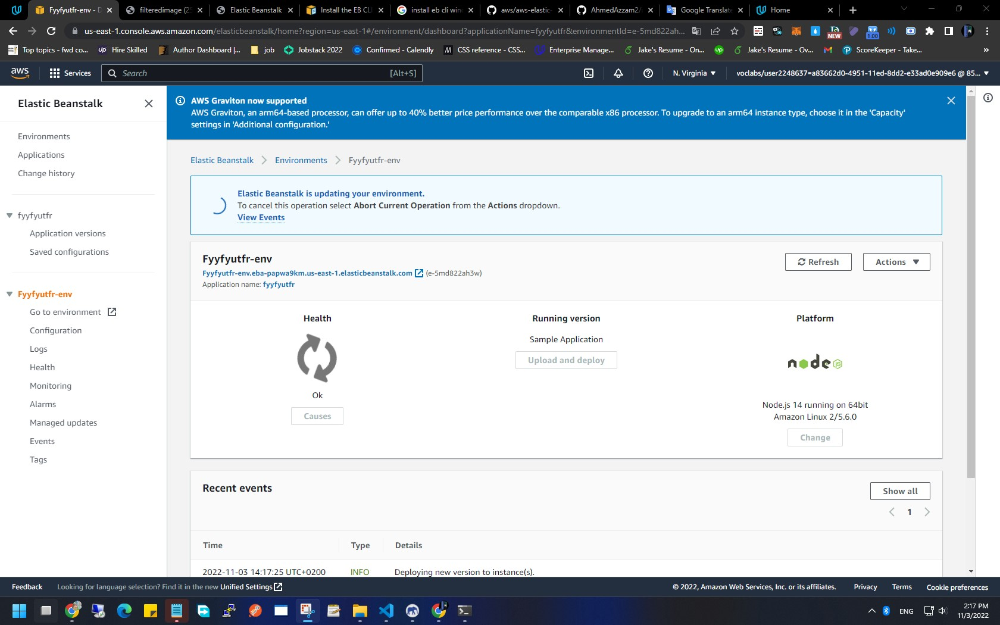
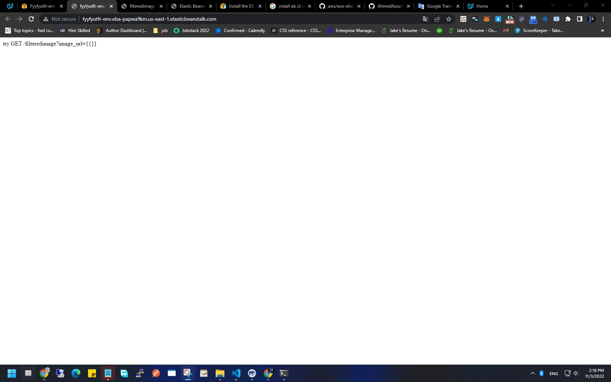
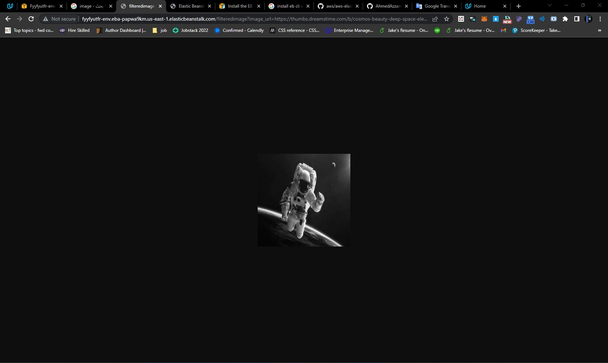

### Deploying your system

Follow the process described in the course to `eb init` a new application and `eb create` a new environment to deploy your image-filter service! Don't forget you can use `eb deploy` to push changes.

## Stand Out (Optional)

### url
http://fyyfyutfr-env.eba-papwa9km.us-east-1.elasticbeanstalk.com/filteredimage?image_url=https://thumbs.dreamstime.com/b/cosmos-beauty-deep-space-elements-image-furnished-nasa-science-fiction-art-102581846.jpg

